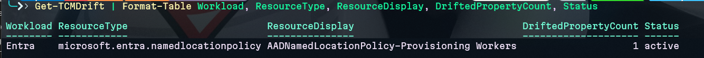
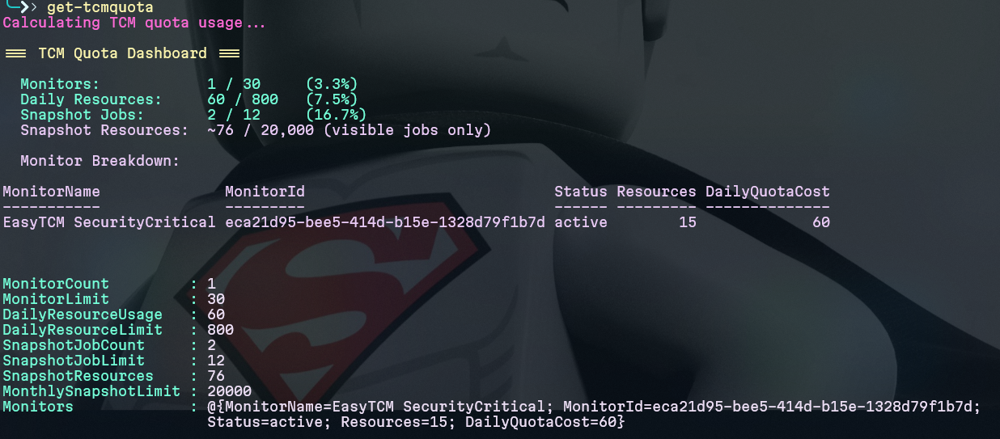

<p align="center">
  <h1 align="center">🛡️ EasyTCM</h1>
  <p align="center">
    <strong>Simplify Microsoft 365 Tenant Configuration Management</strong>
  </p>
  <p align="center">
    The <a href="https://github.com/kayasax/EasyPIM">EasyPIM</a> approach — applied to Microsoft's new <a href="https://learn.microsoft.com/en-us/graph/unified-tenant-configuration-management-concept-overview">Tenant Configuration Management (TCM) APIs</a>.
  </p>
  <p align="center">
    <a href="https://www.powershellgallery.com/packages/EasyTCM"></a>
    <a href="https://www.powershellgallery.com/packages/EasyTCM"></a>
    <a href="https://github.com/kayasax/EasyTCM/stargazers"></a>
    <a href="https://github.com/kayasax/EasyTCM/blob/main/LICENSE"></a>
  </p>
</p>

---

## 💡 Why EasyTCM?

Microsoft's [Tenant Configuration Management (TCM)](https://learn.microsoft.com/en-us/graph/unified-tenant-configuration-management-concept-overview) APIs (public preview) let you **monitor configuration drift** and **snapshot tenant settings** across 6 workloads — but the raw Graph beta API is complex, requires multi-layer authentication, and offers no built-in reporting or remediation.

**EasyTCM** transforms that complexity into simple PowerShell cmdlets:

| Pain Point | EasyTCM Solution |
|---|---|
| 🔧 Complex service principal setup with dual auth layers | `Initialize-TCM` — one command to set up everything |
| 📝 Hand-crafting JSON baselines from 100s of resource types | `ConvertTo-TCMBaseline` — snapshot your current config, convert to baseline |
| 📊 No reporting — raw JSON drifts in Graph API | `Export-TCMDriftReport` — HTML reports with remediation links |
| 🔢 Easy to blow API quotas (800 resources/day, 20k/month) | `Get-TCMQuota` + monitoring profiles (`-Profile SecurityCritical`) — monitor what matters, not everything |
| 🔗 No integration with community security tools | `Sync-TCMDriftToMaester` — bridge to Maester test framework |

---

## 🎯 What Makes EasyTCM Different

- **Snap → Monitor → Report** — The simplest path from zero to continuous tenant monitoring
- **Snapshot-to-Baseline Converter** — Nobody else does this. Take your current config as the known-good state and start monitoring in seconds
- **Quota-Aware** — Built-in profiles (SecurityCritical, Recommended, Full) + real-time quota dashboard. Never waste quota on configs that don't matter
- **Security-Standard Templates** — Pre-built baselines aligned to CIS Benchmarks and CISA SCuBA
- **Maester Bridge** — Use TCM's server-side monitoring as Maester's drift detection backend
- **Multi-Tenant Ready** — Compare configurations across tenants for MSPs and large enterprises

---

## 🚀 Quick Start

```powershell
# 1. Install
Install-Module -Name EasyTCM -Scope CurrentUser

# 2. Connect to Microsoft Graph
Connect-MgGraph -Scopes 'ConfigurationMonitoring.ReadWrite.All'

# 3. One-time setup (registers TCM service principal + grants all workload permissions)
Initialize-TCM

# 4. Snapshot your entire tenant configuration
$snapshot = New-TCMSnapshot -DisplayName 'Initial baseline' -Wait

# 5. Convert snapshot to baseline (the magic step)
$baseline = $snapshot | ConvertTo-TCMBaseline

# 6. Create a monitor — TCM will check every 6 hours
New-TCMMonitor -Name 'Production Baseline' -Baseline $baseline

# 7. Check for drifts
Get-TCMDrift | Format-Table Workload, ResourceType, Property, Expected, Actual

# 8. Feed drifts into Maester — then run Invoke-Maester as usual
Sync-TCMDriftToMaester
```

### See it in action

**Drift detected — property-level details:**



**Real-time quota dashboard:**



---

## 📦 Installation

### From PowerShell Gallery (Recommended)

```powershell
Install-Module -Name EasyTCM -Scope CurrentUser -Force
```

### From Source

```powershell
git clone https://github.com/kayasax/EasyTCM.git
Import-Module ./EasyTCM/EasyTCM/EasyTCM.psd1
```

### Requirements

| Requirement | Details |
|---|---|
| PowerShell | 5.1+ (Windows) or 7.0+ (Cross-platform) |
| Modules | `Microsoft.Graph.Authentication` (auto-installed) |
| Permissions | `ConfigurationMonitoring.ReadWrite.All` or privileged Entra role |
| Tenant | TCM service principal registered (handled by `Initialize-TCM`) |

---

## 📖 Documentation

| Document | Description |
|---|---|
| **[Getting Started](docs/GETTING-STARTED.md)** | Step-by-step guide: install → setup → first monitor in 10 minutes |
| [Product Vision & Roadmap](docs/VISION.md) | Where we're going and why |
| [Launch Kit](docs/LAUNCH-KIT.md) | Blog post, social media copy, YouTube script |
| [Contributing](CONTRIBUTING.md) | How to contribute cmdlets, templates, and fixes |
| [Changelog](CHANGELOG.md) | Version history |

---

## 🎯 Cmdlets — v0.1.0 (15 shipped)

### Setup & Authentication

| Cmdlet | Description |
|---|---|
| `Initialize-TCM` | Register TCM service principal, grant workload permissions, validate setup |
| `Test-TCMConnection` | Verify authentication and TCM readiness |

### Snapshots

| Cmdlet | Description |
|---|---|
| `New-TCMSnapshot` | Create a snapshot job with workload shortcuts and optional `-Wait` |
| `Get-TCMSnapshot` | Retrieve snapshot jobs with optional `-IncludeContent` |
| `Remove-TCMSnapshot` | Delete a snapshot job |
| `ConvertTo-TCMBaseline` | ⭐ **Snapshot → baseline with smart profiles** — SecurityCritical (default), Recommended, or Full |

### Monitors

| Cmdlet | Description |
|---|---|
| `New-TCMMonitor` | Create a configuration monitor with quota-aware warnings |
| `Get-TCMMonitor` | List and retrieve monitor details with optional baseline |
| `Update-TCMMonitor` | Update a monitor's baseline (⚠️ deletes existing drifts) |
| `Remove-TCMMonitor` | Delete a monitor |

### Drift Detection, Reporting & Quota

| Cmdlet | Description |
|---|---|
| `Get-TCMDrift` | Enriched drifts with workload classification, filtering |
| `Get-TCMMonitoringResult` | Monitor cycle results — run status, timing, drift counts, next-run estimate |
| `Export-TCMDriftReport` | ⭐ **HTML dashboard** with quota bars, property-level diffs, admin portal deep links |
| `Get-TCMQuota` | Real-time quota dashboard (monitors, resources, snapshots) |


### 🔗 Maester Bridge (North Star)

| Cmdlet | Description |
|---|---|
| `Sync-TCMDriftToMaester` | Generate Maester-compatible drift suites — MT.1060 picks them up natively, zero Maester modification needed |


### 🔮 Planned

| Cmdlet | Target | Description |
|---|---|---|
| `Repair-TCMDrift` | v0.3 | Generate remediation scripts from detected drifts |
| `Compare-TCMTenant` | v0.3 | Compare configurations across two tenants |
| Baseline Templates | v0.2 | CIS/CISA pre-built baselines via `-Template` parameter |

---

## 📊 TCM Workload Coverage

EasyTCM wraps TCM's workload support (62 validated resource types):

| Workload | Types | Examples |
|---|---|---|
| **Microsoft Entra** | 10 | Conditional Access, Auth Methods, Named Locations, Cross-tenant Access, Authorization Policy |
| **Microsoft Exchange** | 18 | Transport Rules, Accepted Domains, Anti-phishing, Anti-spam, DKIM, Connectors |
| **Microsoft Intune** | 1 | Device Configuration |
| **Microsoft Teams** | 9 | Meeting Policies, Messaging Policies, Federation, App Permission Policies |
| **Security & Compliance** | 24 | DLP Policies, Retention Policies, Sensitivity Labels, Compliance Tags, Case Hold, Supervision |

Full resource type list: [TCM Schema Store](https://json.schemastore.org/utcm-monitor.json)

---

## ⚠️ TCM Quota Reality (Why Profiles Matter)

| Resource | Limit | What it means |
|---|---|---|
| Monitors per tenant | 30 | Plenty — not the bottleneck |
| Monitor frequency | Fixed every 6 hours | 4 runs/day per monitor, non-negotiable |
| **Monitored resources/day** | **800 across all monitors** | **THE bottleneck — 800 ÷ 4 = 200 instances max** |
| Snapshot resources/month | 20,000 cumulative | Generous — snapshot freely |
| Visible snapshot jobs | 12 | Clean up old snapshots periodically |
| Snapshot retention | 7 days | — |
| Resolved drift retention | 30 days | — |

### The math that matters

A typical tenant has 300-500 resource instances across all workloads. Monitoring everything uses 1200-2000 resources/day — **instant quota death**.

**EasyTCM's solution: monitoring profiles in `ConvertTo-TCMBaseline`**

| Profile | Types | Daily cost (typical) | Use case |
|---|---|---|---|
| `SecurityCritical` (default) | ~16 | ~80-120/day | CA policies, auth methods, mail security, federation |
| `Recommended` | ~30 | ~200-400/day | Above + roles, compliance, device policies |
| `Full` | ~52 | 400-2000+/day | ⚠️ Will likely exceed quota |

```powershell
# Default — quota-safe, covers 80% of attack surface
$baseline = $snapshot | ConvertTo-TCMBaseline

# Broader coverage — check your quota first
$baseline = $snapshot | ConvertTo-TCMBaseline -Profile Recommended

# Everything — only if you have very few resource instances
$baseline = $snapshot | ConvertTo-TCMBaseline -Profile Full
```

`Get-TCMQuota` tracks all limits in real-time. `New-TCMMonitor` warns before creating a monitor that would exceed quota.

---

## 🏗️ Project Roadmap

### ✅ Phase 1 — Foundation (v0.1.0) — SHIPPED
- [x] PowerShell module scaffold (14 cmdlets)
- [x] `Initialize-TCM` — one-command setup
- [x] Snapshot cmdlets with workload shortcuts
- [x] Monitor CRUD with quota-aware warnings
- [x] `ConvertTo-TCMBaseline` — Snap → Baseline converter
- [x] `Get-TCMDrift` with workload enrichment
- [x] `Get-TCMQuota` — real-time quota dashboard
- [x] `Sync-TCMDriftToMaester` — Maester bridge (north star)
- [x] GitHub Actions CI + PSGallery publish workflow
- [x] Pester unit tests

### 🏗️ Phase 2 — Validate & Report (v0.2.0) — IN PROGRESS
- [x] ✅ Validate all cmdlets against live TCM tenant (62 resource types across 5 workloads)
- [x] ✅ Refine `ConvertTo-TCMBaseline` with real snapshot data + monitoring profiles
- [x] ✅ `Export-TCMDriftReport` — HTML dashboard with quota bars, property diffs, admin portal deep links
- [x] ✅ `Get-TCMMonitoringResult` — monitor cycle visibility (hidden `configurationMonitoringResults` endpoint)
- [ ] Teams adaptive card notifications
- [ ] CIS/CISA baseline templates
- [ ] Publish to PSGallery

### 🔮 Phase 3 — Ecosystem (v0.3.0+)
- [ ] Propose TCM data source to maester365/maester community
- [ ] Remediation script generation (`Repair-TCMDrift`)
- [ ] Multi-tenant comparison (`Compare-TCMTenant`)
- [ ] Multi-cloud support (GCC, China, Germany)
- [ ] EntraExporter integration

---

## 🤝 Contributing

Contributions are welcome! See [CONTRIBUTING.md](CONTRIBUTING.md) for guidelines.

```powershell
# Clone and load for development
git clone https://github.com/kayasax/EasyTCM.git
cd EasyTCM
Import-Module ./EasyTCM/EasyTCM.psd1
Invoke-Pester ./tests/
```

---

## 📚 Resources

- [TCM Concept Overview](https://learn.microsoft.com/en-us/graph/unified-tenant-configuration-management-concept-overview) — Microsoft's official TCM documentation
- [TCM API Reference (beta)](https://learn.microsoft.com/en-us/graph/api/resources/unified-tenant-configuration-management-api-overview?view=graph-rest-beta) — Graph API reference
- [TCM Authentication Setup](https://learn.microsoft.com/en-us/graph/utcm-authentication-setup) — Service principal and permission configuration
- [TCM Schema Store](https://json.schemastore.org/utcm-monitor.json) — Complete resource type schemas
- [EasyPIM](https://github.com/kayasax/EasyPIM) — Sister project for PIM management
- [Maester](https://maester.dev/) — Microsoft 365 security test automation framework

---

## 📄 License

This project is licensed under the MIT License — see the [LICENSE](LICENSE) file for details.

---

<p align="center">
  Built with ❤️ for the Microsoft 365 Administrator Community<br>
  <strong>By the creator of <a href="https://github.com/kayasax/EasyPIM">EasyPIM</a></strong>
</p>
