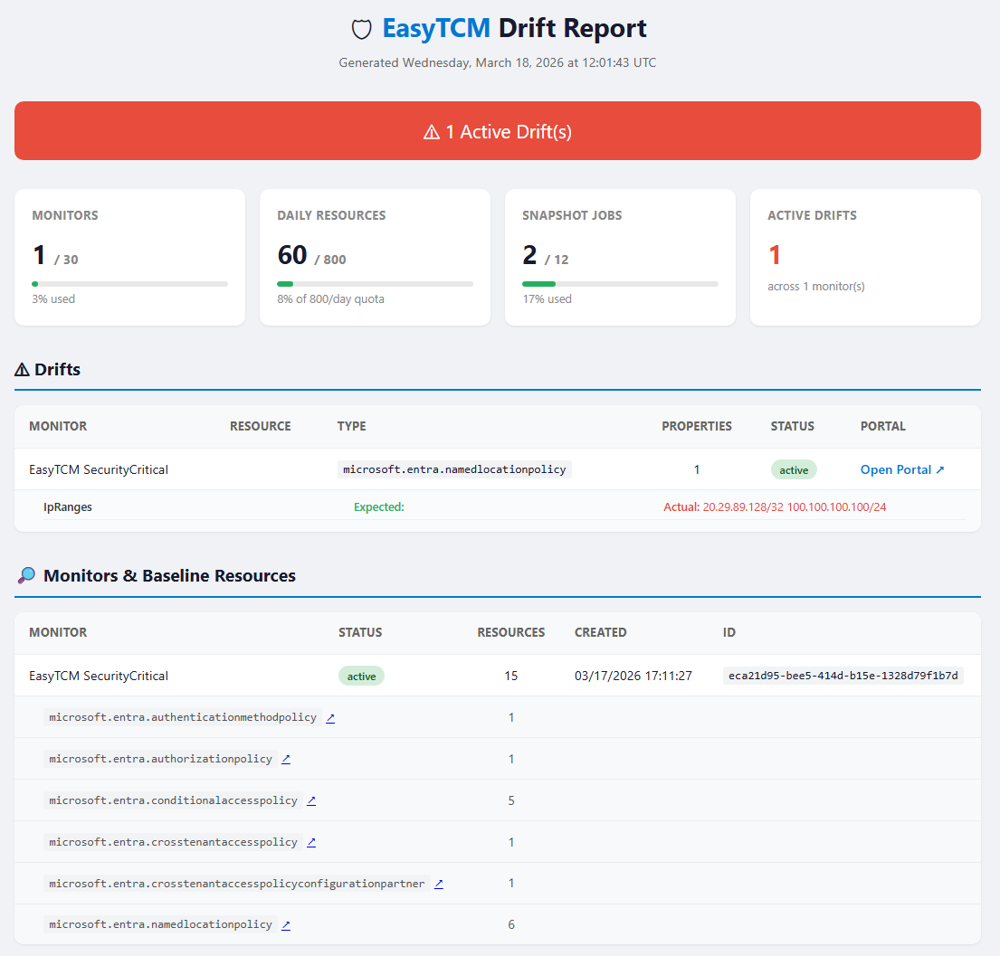
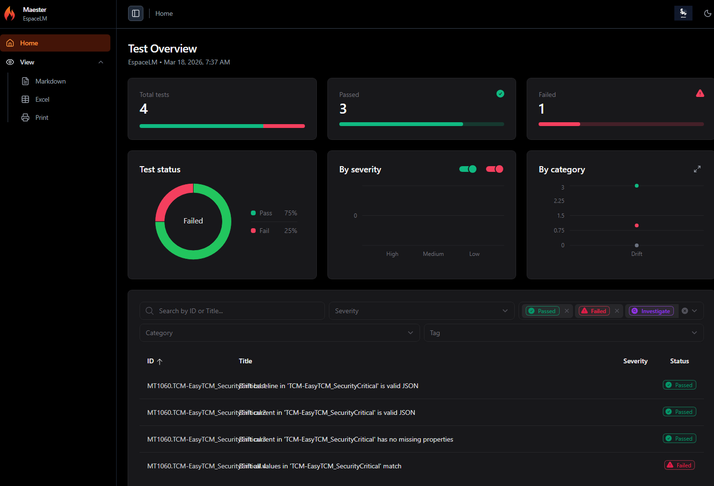

<p align="center">
  <h1 align="center">🛡️ EasyTCM</h1>
  <p align="center">
    <strong>Stop Microsoft 365 tenant drift before it becomes a breach.</strong>
  </p>
  <p align="center">
    <a href="https://www.powershellgallery.com/packages/EasyTCM"></a>
    <a href="https://www.powershellgallery.com/packages/EasyTCM"></a>
    <a href="https://github.com/kayasax/EasyTCM/stargazers"></a>
    <a href="https://github.com/kayasax/EasyTCM/blob/main/LICENSE"></a>
  </p>
</p>

---

Someone changes a Conditional Access policy. A transport rule gets modified. An auth method is disabled. **You don't know until something breaks — or fails an audit.**

Microsoft's new [TCM APIs](https://learn.microsoft.com/en-us/graph/unified-tenant-configuration-management-concept-overview) monitor your tenant configuration server-side every 6 hours across Entra, Exchange, Intune, Teams, and Security & Compliance. EasyTCM makes them accessible through 3 simple commands.

## 🚀 Three Commands. That's It.

```powershell
Install-Module EasyTCM

# 1. Setup (one time — guided wizard handles everything)
Start-TCMMonitoring

# 2. Check for drift (daily)
Show-TCMDrift

# 3. After approved changes, accept the new state
Update-TCMBaseline
```

### What Each Command Does

**`Start-TCMMonitoring`** — Guided wizard: connects to Graph, creates the TCM service principal, snapshots your tenant, builds a security-focused baseline, creates a monitor. Zero to monitoring in one run.

**`Show-TCMDrift`** — Your daily command:
```powershell
Show-TCMDrift                    # quick console summary
Show-TCMDrift -Report            # HTML dashboard with admin portal links
Show-TCMDrift -Maester           # pipe results into Maester test framework
Show-TCMDrift -CompareBaseline   # also catch new/deleted resources
```

**`Update-TCMBaseline`** — After you verify drift is from approved changes, rebaseline with one command. Shows current drift for review, takes fresh snapshot, updates the monitor.

---

## 📸 See It In Action

**Console drift check:**

```
🔍 Checking for configuration drift...

  ⚠️  3 active drift(s) detected!

  conditionalaccesspolicy (2):
    • Block Legacy Auth — 1 changed property
      state: enabled → disabled
    • Require MFA for Admins — 1 changed property
      excludeUsers: [] → ["breakglass@contoso.com"]

  namedlocation (1):
    • Corporate Network — 1 changed property
      ipRanges: ["10.0.0.0/8"] → ["10.0.0.0/8","192.168.0.0/16"]
```

**HTML drift report with remediation links:**



**Maester integration — drift as test results:**



---

## 📦 Install

```powershell
Install-Module EasyTCM -Scope CurrentUser
```

| Requirement | Details |
|---|---|
| PowerShell | 5.1+ or 7.0+ |
| Graph module | `Microsoft.Graph.Authentication` (auto-installed) |
| Permissions | Global Admin for initial setup, then `ConfigurationMonitoring.ReadWrite.All` |

---

## 📖 Learn More

| | |
|---|---|
| **[📖 Full Documentation](https://kayasax.github.io/EasyTCM/)** | **The complete story: problem → solution → Maester → automation** |
| [Maester Integration](https://kayasax.github.io/EasyTCM/maester-integration) | Why & how to combine TCM + Maester for unified security reporting |
| [Continuous Monitoring & Automation](https://kayasax.github.io/EasyTCM/continuous-monitoring) | Daily checks → rebaselining → Task Scheduler / Azure Automation / GitHub Actions |
| [Getting Started (Advanced)](docs/GETTING-STARTED.md) | Step-by-step guide with granular control over each cmdlet |
| [Changelog](CHANGELOG.md) | Version history |

---

## 🔧 All 19 Cmdlets

<details>
<summary>Click to expand the full cmdlet reference</summary>

### Easy Buttons (v0.3.0)

| Cmdlet | Description |
|---|---|
| `Start-TCMMonitoring` | Guided wizard: connect → setup → snapshot → baseline → monitor |
| `Show-TCMDrift` | Daily drift check: console, `-Report` HTML, `-Maester` tests |
| `Update-TCMBaseline` | Rebaseline after approved changes |

### Setup

| Cmdlet | Description |
|---|---|
| `Initialize-TCM` | Register TCM service principal, grant permissions |
| `Test-TCMConnection` | Verify authentication and TCM readiness |

### Snapshots

| Cmdlet | Description |
|---|---|
| `New-TCMSnapshot` | Snapshot tenant config with workload shortcuts + `-Wait` |
| `Get-TCMSnapshot` | Retrieve snapshots with optional `-IncludeContent` |
| `Remove-TCMSnapshot` | Delete a snapshot job |
| `ConvertTo-TCMBaseline` | Snapshot → baseline with profiles (SecurityCritical / Recommended / Full) |

### Monitors

| Cmdlet | Description |
|---|---|
| `New-TCMMonitor` | Create a monitor with quota-aware warnings |
| `Get-TCMMonitor` | List monitors with baseline summary |
| `Update-TCMMonitor` | Update baseline (⚠️ deletes existing drifts) |
| `Remove-TCMMonitor` | Delete a monitor |

### Drift & Reporting

| Cmdlet | Description |
|---|---|
| `Get-TCMDrift` | Enriched drifts with workload classification |
| `Get-TCMMonitoringResult` | Monitor cycle status and timing |
| `Export-TCMDriftReport` | HTML dashboard with admin portal deep links |
| `Compare-TCMBaseline` | Detect new/deleted resources not in baseline |
| `Get-TCMQuota` | Real-time quota dashboard |

### Maester Bridge

| Cmdlet | Description |
|---|---|
| `Sync-TCMDriftToMaester` | Generate Maester-compatible drift test suites |

</details>

---

## 🌐 Coverage

6 workloads, 62 resource types: **Entra** (CA policies, auth methods, named locations) · **Exchange** (transport rules, anti-phishing, DKIM) · **Intune** (device config) · **Teams** (meeting/messaging policies, federation) · **Security & Compliance** (DLP, retention, sensitivity labels)

---

## 🤝 Contributing

```powershell
git clone https://github.com/kayasax/EasyTCM.git
cd EasyTCM; Import-Module ./EasyTCM/EasyTCM.psd1; Invoke-Pester ./tests/
```

See [CONTRIBUTING.md](CONTRIBUTING.md) for guidelines.

---

<p align="center">
  Built with ❤️ for the Microsoft 365 Administrator Community<br>
  <strong>By the creator of <a href="https://github.com/kayasax/EasyPIM">EasyPIM</a></strong>
</p>
