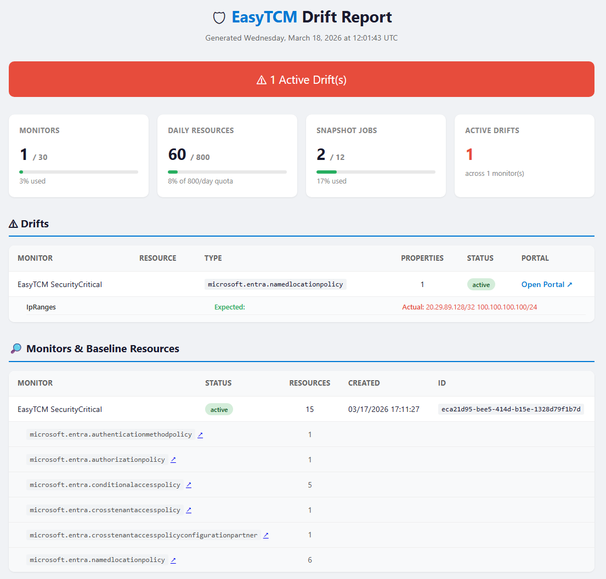
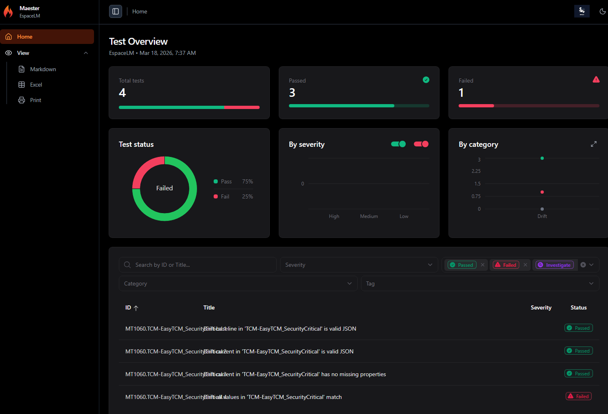

<p align="center">
  <h1 align="center">🛡️ EasyTCM</h1>
  <p align="center">
    <strong>Stop Microsoft 365 tenant drift before it becomes a breach.</strong>
  </p>
  <p align="center">
    <a href="https://www.powershellgallery.com/packages/EasyTCM"></a>
    <a href="https://www.powershellgallery.com/packages/EasyTCM"></a>
    <a href="https://github.com/kayasax/EasyTCM/stargazers"></a>
    <a href="https://github.com/kayasax/EasyTCM/blob/main/LICENSE"></a>
  </p>
</p>

---

Someone changes a Conditional Access policy. A transport rule gets modified. An auth method is disabled. **You don't know until something breaks — or fails an audit.**

Microsoft's new [TCM APIs](https://learn.microsoft.com/en-us/graph/unified-tenant-configuration-management-concept-overview) monitor your tenant configuration server-side every 6 hours across Entra, Exchange, Intune, Teams, and Security & Compliance.  

**EasyTCM** makes them accessible through 3 simple commands.

## 🚀 Three Commands. That's It.

```powershell
Install-Module EasyTCM

# 1. Setup (one time — guided wizard handles everything)
Start-TCMMonitoring

# 2. Check for drift (daily)
Show-TCMDrift

# 3. After approved changes, accept the new state
Update-TCMBaseline
```

### What Each Command Does

**`Start-TCMMonitoring`** — Guided wizard: connects to Graph, creates the TCM service principal, snapshots your tenant, builds a security-focused baseline, creates a monitor. Zero to monitoring in one run.

**`Show-TCMDrift`** — Your daily command:
```powershell
Show-TCMDrift                    # quick console summary
Show-TCMDrift -Report            # HTML dashboard with admin portal links
Show-TCMDrift -Maester           # pipe results into Maester test framework
Show-TCMDrift -CompareBaseline   # also catch new/deleted resources
```

**`Update-TCMBaseline`** — After you verify drift is from approved changes, rebaseline with one command. Shows current drift for review, takes fresh snapshot, updates the monitor.

---

## 📸 See It In Action

**Console drift check:**

```
🔍 Checking for configuration drift...

  ⚠️  3 active drift(s) detected!

  conditionalaccesspolicy (2):
    • Block Legacy Auth — 1 changed property
      state: enabled → disabled
    • Require MFA for Admins — 1 changed property
      excludeUsers: [] → ["breakglass@contoso.com"]

  namedlocation (1):
    • Corporate Network — 1 changed property
      ipRanges: ["10.0.0.0/8"] → ["10.0.0.0/8","192.168.0.0/16"]
```

**HTML drift report with remediation links:**



**Maester integration — drift as test results:**



---

## 🏛️ CISA SCuBA Baseline Templates

Scope your TCM monitor to **only the resource types that matter for CISA compliance**. When a CISA-relevant config changes, you'll know within 6 hours.

```powershell
# Create a CISA-scoped monitor in one pipeline
New-TCMSnapshot -Wait | ConvertTo-TCMBaseline -Template CISA-SCuBA-Entra -DisplayName 'CISA Entra' | New-TCMMonitor

# Or combine all three workloads
$snap = New-TCMSnapshot -Workload Entra, Exchange, Teams -Wait
ConvertTo-TCMBaseline -SnapshotContent $snap -Template CISA-SCuBA-Entra, CISA-SCuBA-Exchange, CISA-SCuBA-Teams
```

> **EasyTCM watches the config. Maester/ScubaGear checks the rules.**
> Use `Show-TCMDrift -Maester` to pipe TCM drift into Maester's test framework for unified reporting.

Three built-in templates cover 41 CISA SCuBA controls across 23 TCM resource types:

<details>
<summary><strong>CISA-SCuBA-Entra</strong> — 18 controls, 6 resource types</summary>

| Control | Severity | BOD 25-01 | What TCM Monitors |
|---|---|---|---|
| MS.AAD.1.1v1 | SHALL | ✅ | CA policy blocking legacy auth |
| MS.AAD.2.1v1 | SHALL | ✅ | CA policy blocking high-risk users |
| MS.AAD.2.3v1 | SHALL | ✅ | CA policy blocking high-risk sign-ins |
| MS.AAD.3.1v1 | SHALL | ✅ | CA policy enforcing phishing-resistant MFA |
| MS.AAD.3.2v1 | SHALL | ✅ | CA policy enforcing alternative MFA |
| MS.AAD.3.3v2 | SHALL | ✅ | Authenticator login context (auth method policy) |
| MS.AAD.3.4v1 | SHALL | ✅ | Auth Methods migration state (auth method policy) |
| MS.AAD.3.5v2 | SHALL | ✅ | SMS/Voice/Email OTP disabled (auth method policy) |
| MS.AAD.3.6v1 | SHALL | ✅ | CA policy for privileged role MFA |
| MS.AAD.3.7v1 | SHOULD | | CA policy requiring managed devices |
| MS.AAD.3.8v1 | SHOULD | | CA policy for MFA registration device requirement |
| MS.AAD.3.9v1 | SHOULD | | CA policy blocking device code flow |
| MS.AAD.5.1v1 | SHALL | ✅ | App registration restriction (authorization policy) |
| MS.AAD.5.2v1 | SHALL | ✅ | App consent restriction (authorization policy) |
| MS.AAD.5.3v1 | SHALL | ✅ | Admin consent workflow (authorization policy) |
| MS.AAD.8.1v1 | SHOULD | | Guest directory access (authorization policy) |
| MS.AAD.8.2v1 | SHOULD | | Guest invitation policy (cross-tenant access) |
| MS.AAD.8.3v1 | SHOULD | | Guest domain restrictions (cross-tenant access) |

Resource types: `conditionalaccesspolicy`, `authenticationmethodpolicy`, `authorizationpolicy`, `crosstenantaccesspolicy`, `crosstenantaccesspolicyconfigurationpartner`, `namedlocationpolicy`
</details>

<details>
<summary><strong>CISA-SCuBA-Exchange</strong> — 14 controls, 12 resource types</summary>

| Control | Severity | BOD 25-01 | What TCM Monitors |
|---|---|---|---|
| MS.EXO.1.1v2 | SHALL | ✅ | Auto-forwarding (outbound spam filter) |
| MS.EXO.3.1v1 | SHOULD | | DKIM signing config |
| MS.EXO.5.1v1 | SHALL | ✅ | SMTP AUTH (organization config) |
| MS.EXO.6.1v1 | SHALL | ✅ | Contact folder sharing (organization config) |
| MS.EXO.6.2v1 | SHALL | ✅ | Calendar sharing (organization config) |
| MS.EXO.7.1v1 | SHALL | ✅ | External sender warnings (transport rules) |
| MS.EXO.11.1v1 | SHOULD | | Impersonation protection (anti-phish policy) |
| MS.EXO.11.3v1 | SHOULD | | Mailbox Intelligence (anti-phish policy) |
| MS.EXO.12.1v1 | SHOULD | | IP allow lists (content filter policy) |
| MS.EXO.12.2v1 | SHOULD | | Safe lists (content filter policy) |
| MS.EXO.13.1v1 | SHALL | ✅ | Mailbox auditing (organization config) |
| MS.EXO.14.3v1 | SHALL | | Allowed domains in anti-spam |
| MS.EXO.15.1v1 | SHOULD | | Safe Links URL scanning |
| MS.EXO.15.2v1 | SHOULD | | Safe Attachments malware scanning |

Resource types: `antiphishpolicy`, `antiphishrule`, `hostedcontentfilterpolicy`, `hostedoutboundspamfilterpolicy`, `safeattachmentpolicy`, `safelinkspolicy`, `transportrule`, `dkimsigningconfig`, `organizationconfig`, `malwarefilterrule`, `inboundconnector`, `outboundconnector`
</details>

<details>
<summary><strong>CISA-SCuBA-Teams</strong> — 9 controls, 5 resource types</summary>

| Control | Severity | BOD 25-01 | What TCM Monitors |
|---|---|---|---|
| MS.TEAMS.1.1v1 | SHALL | ✅ | External access per-domain (federation config) |
| MS.TEAMS.1.2v1 | SHALL | ✅ | Authorized domains only (federation config) |
| MS.TEAMS.1.3v1 | SHALL | ✅ | Unmanaged user contact (federation config) |
| MS.TEAMS.1.4v1 | SHOULD | | Skype interop (federation config) |
| MS.TEAMS.2.1v1 | SHALL | ✅ | Anonymous meeting join (meeting policy) |
| MS.TEAMS.2.2v1 | SHOULD | | Anonymous auto-admit (meeting config) |
| MS.TEAMS.2.3v1 | SHOULD | | External participant control (meeting policy) |
| MS.TEAMS.4.1v1 | SHOULD | | App permission policy |
| MS.TEAMS.6.1v1 | SHOULD | | Security reporting (messaging policy) |

Resource types: `federationconfiguration`, `meetingpolicy`, `messagingpolicy`, `apppermissionpolicy`, `meetingconfiguration`
</details>

---

## 📦 Install

```powershell
Install-Module EasyTCM -Scope CurrentUser
```

| Requirement | Details |
|---|---|
| PowerShell | 5.1+ or 7.0+ |
| Graph module | `Microsoft.Graph.Authentication` (auto-installed) |
| Permissions | Global Admin for initial setup, then `ConfigurationMonitoring.ReadWrite.All` |

---

## 📖 Learn More

| | |
|---|---|
| **[📖 Full Documentation](https://kayasax.github.io/EasyTCM/)** | **The complete story: problem → solution → Maester → automation** |
| [Maester Integration](https://kayasax.github.io/EasyTCM/maester-integration) | Why & how to combine TCM + Maester for unified security reporting |
| [Continuous Monitoring & Automation](https://kayasax.github.io/EasyTCM/continuous-monitoring) | Daily checks → rebaselining → Task Scheduler / Azure Automation / GitHub Actions |
| [GitHub Actions Workflows](https://kayasax.github.io/EasyTCM/github-actions) | Ready-to-use Maester + TCM drift detection workflows — setup guide |
| [Getting Started (Advanced)](docs/GETTING-STARTED.md) | Step-by-step guide with granular control over each cmdlet |
| [Changelog](CHANGELOG.md) | Version history |

---

## ⚙️ GitHub Actions

Two ready-to-use workflows live in [`.github/workflows/`](.github/workflows/):

| Workflow | What it does |
|----------|-------------|
| [`maester.yml`](.github/workflows/maester.yml) | **Vanilla Maester** — 400+ daily M365 security checks, HTML report artifact |
| [`maester-tcm.yml`](.github/workflows/maester-tcm.yml) | **Maester + TCM** — security checks AND drift detection in one report |

```yaml
# Add to your repo — that's it.
# Runs daily at 06:00 UTC and on manual trigger.
on:
  schedule:
    - cron: '0 6 * * *'
  workflow_dispatch:
```

Drift = failing Pester test = workflow failure = **free alerting via GitHub notifications**.

See the **[full setup guide](https://kayasax.github.io/EasyTCM/github-actions)** for app registration, permissions, OIDC vs client-secret auth, and troubleshooting.

---

## 🔧 All 20 Cmdlets

<details>
<summary>Click to expand the full cmdlet reference</summary>

### Easy Buttons (v0.3.0+)

| Cmdlet | Description |
|---|---|
| `Start-TCMMonitoring` | Guided wizard: connect → setup → snapshot → baseline → monitor |
| `Show-TCMDrift` | Daily drift check: console, `-Report` HTML, `-Maester` tests |
| `Update-TCMBaseline` | Rebaseline after approved changes |
| `Register-TCMSchedule` | One-command setup for automated drift monitoring with Teams notifications |

### Setup

| Cmdlet | Description |
|---|---|
| `Initialize-TCM` | Register TCM service principal, grant permissions |
| `Test-TCMConnection` | Verify authentication and TCM readiness |

### Snapshots

| Cmdlet | Description |
|---|---|
| `New-TCMSnapshot` | Snapshot tenant config with workload shortcuts + `-Wait` |
| `Get-TCMSnapshot` | Retrieve snapshots with optional `-IncludeContent` |
| `Remove-TCMSnapshot` | Delete a snapshot job |
| `ConvertTo-TCMBaseline` | Snapshot → baseline with profiles or `-Template` compliance filtering |

### Monitors

| Cmdlet | Description |
|---|---|
| `New-TCMMonitor` | Create a monitor with quota-aware warnings |
| `Get-TCMMonitor` | List monitors with baseline summary |
| `Update-TCMMonitor` | Update baseline (⚠️ deletes existing drifts) |
| `Remove-TCMMonitor` | Delete a monitor |

### Drift & Reporting

| Cmdlet | Description |
|---|---|
| `Get-TCMDrift` | Enriched drifts with workload classification |
| `Get-TCMMonitoringResult` | Monitor cycle status and timing |
| `Export-TCMDriftReport` | HTML dashboard with admin portal deep links |
| `Compare-TCMBaseline` | Detect new/deleted resources not in baseline |
| `Get-TCMQuota` | Real-time quota dashboard |

### Maester Bridge

| Cmdlet | Description |
|---|---|
| `Sync-TCMDriftToMaester` | Generate Maester-compatible drift test suites |

</details>

---

## 🌐 Coverage

6 workloads, 62 resource types: **Entra** (CA policies, auth methods, named locations) · **Exchange** (transport rules, anti-phishing, DKIM) · **Intune** (device config) · **Teams** (meeting/messaging policies, federation) · **Security & Compliance** (DLP, retention, sensitivity labels)

**Compliance templates:** 3 CISA SCuBA baselines (Entra, Exchange, Teams) scope your monitors to security-relevant resource types. See [templates/](templates/).

---

## 🤝 Contributing

```powershell
git clone https://github.com/kayasax/EasyTCM.git
cd EasyTCM; Import-Module ./EasyTCM/EasyTCM.psd1; Invoke-Pester ./tests/
```

See [CONTRIBUTING.md](CONTRIBUTING.md) for guidelines.

---

<p align="center">
  Built with ❤️ for the Microsoft 365 Administrator Community<br>
  <strong>By the creator of <a href="https://github.com/kayasax/EasyPIM">EasyPIM</a></strong>
</p>
