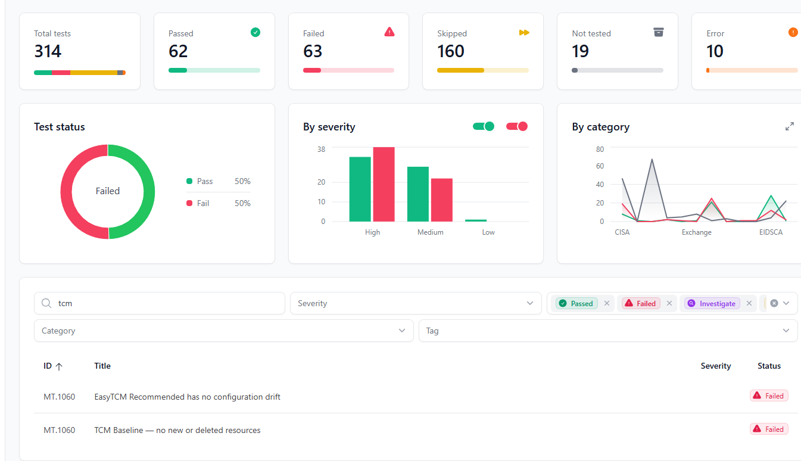
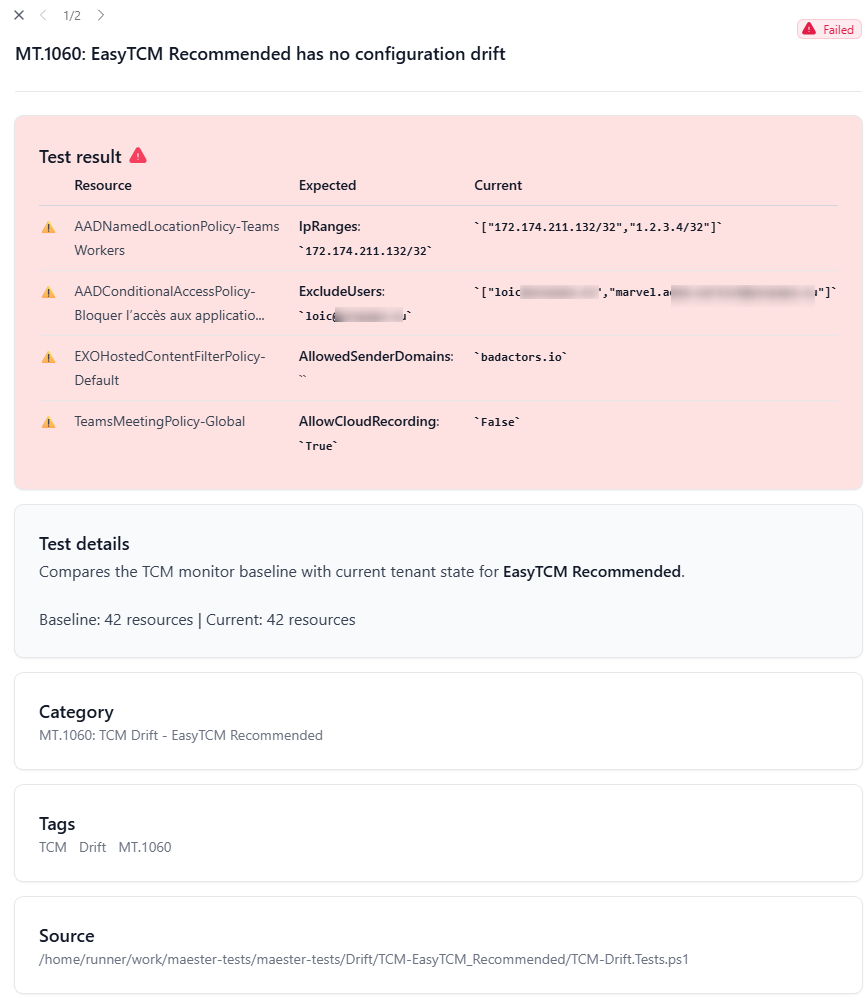

# 🔄 Continuous Monitoring Guide

**The complete lifecycle: setup → daily checks → rebaselining → automation.**

EasyTCM provides three "easy button" cmdlets that cover the entire monitoring lifecycle. No deep TCM knowledge required.

---

## The Lifecycle

```
┌──────────────────────┐
│  Start-TCMMonitoring │  ← One-time setup (5 minutes)
│  Guided wizard       │
└──────────┬───────────┘
           │
           ▼
┌──────────────────────┐
│    Show-TCMDrift    │  ← Daily check (30 seconds)
│  Console / Report /  │
│  Maester             │
└──────────┬───────────┘
           │
     Drift detected?
     ┌─────┴─────┐
     │           │
   No ✅      Yes ⚠️
     │           │
     │     Investigate
     │           │
     │     Approved change?
     │     ┌─────┴─────┐
     │     │           │
     │   Yes         No 🚨
     │     │        Remediate!
     │     ▼
     │  ┌──────────────────────┐
     │  │  Update-TCMBaseline  │  ← Accept new state
     │  │  Rebaseline          │
     │  └──────────┬───────────┘
     │             │
     └──────►──────┘
              │
        Continue monitoring
```

---

## Step 1: Initial Setup

### The One-Command Way

```powershell
Install-Module EasyTCM -Scope CurrentUser
Start-TCMMonitoring
```

`Start-TCMMonitoring` handles everything:

```
╔══════════════════════════════════════════════════════╗
║         EasyTCM — Start Monitoring Setup             ║
╚══════════════════════════════════════════════════════╝

[ 1/5 ] Checking Microsoft Graph connection...
  Connected as admin@contoso.com to tenant abc123...

[ 2/5 ] Setting up TCM service principal and permissions...
  TCM service principal is ready.

[ 3/5 ] Checking for existing monitors...

[ 4/5 ] Taking a snapshot of your tenant (Recommended profile)...
  Converting snapshot to baseline...

[ 5/5 ] Creating monitor...

╔══════════════════════════════════════════════════════╗
║         ✅ Monitoring is now active!                  ║
╚══════════════════════════════════════════════════════╝

  Monitor : EasyTCM Recommended
  Profile : Recommended (28 resources)
  Schedule: TCM checks every 6 hours automatically
```

### Choosing a Profile

| Profile | Best For | Quota Impact |
|---------|----------|-------------|
| **Recommended** (default) | Most tenants — broad coverage, quota-safe | ~10-50% of daily limit |
| **SecurityCritical** | Strict quota or security-only focus | ~5-15% of daily limit |

```powershell
# Security-focused only
Start-TCMMonitoring -Profile SecurityCritical

# Already ran Initialize-TCM before? Skip that step
Start-TCMMonitoring -SkipInitialize
```

---

## Step 2: Daily Drift Checks

### Quick Console Check (30 seconds)

```powershell
Show-TCMDrift
```

Shows a color-coded summary: green (no drift) or yellow (drift detected) with resource details.

### HTML Report (for auditors, managers, compliance)

```powershell
Show-TCMDrift -Report
```



Generates an HTML dashboard with:
- Monitor status and quota usage (progress bars)
- Active drifts grouped by workload with property-level diffs
- Admin portal deep links for each resource type (click to remediate)
- Baseline inventory summary

### Maester Integration (for security teams)

```powershell
Show-TCMDrift -Maester
```



Syncs drift data to Maester test format and runs `Invoke-Maester`. Results appear in Maester's HTML report alongside the 400+ built-in security checks.

### Finding Untracked Resources

TCM only monitors resources in the baseline. New CA policies or deleted transport rules won't appear as drift. Add `-CompareBaseline` to catch them:

```powershell
Show-TCMDrift -CompareBaseline
```

Results are cached for 1 hour (uses a snapshot, which counts against quota).

---

## Step 3: Investigating Drift

When drift is detected, ask yourself:

| Question | If Yes | If No |
|----------|--------|-------|
| Was this an **approved change**? | Update the baseline | Investigate further |
| Was this change **expected** (rollout, migration)? | Update the baseline | This may be unauthorized |
| Does the change **weaken security**? | Remediate immediately | May still need review |

### Getting Details

```powershell
# Pipeline: get full drift objects
$drifts = Show-TCMDrift -PassThru

# Filter to security-critical types
$drifts | Where-Object { $_.ResourceType -match 'conditionalaccesspolicy|authenticationmethod' }

# Full HTML report for documentation
Show-TCMDrift -Report
```

---

## Step 4: Updating the Baseline

After **confirmed, approved changes**, accept the new tenant state:

```powershell
Update-TCMBaseline
```

This:
1. Shows current active drift (so you can review one last time)
2. Takes a fresh snapshot
3. Converts it to a baseline with the same profile
4. Updates the monitor
5. Clears all previous drift records

```
🔄 Update-TCMBaseline — Rebaseline after approved changes

Retrieving current monitor...
  Monitor: EasyTCM Recommended
  Profile: Recommended

  ⚠️  3 active drift(s) that will be cleared:
    • conditionalaccesspolicy — Block Legacy Auth (1 changes)
    • namedlocation — Corporate Network (1 changes)
    • transportrule — External Email Warning (2 changes)

Taking fresh snapshot...
Converting snapshot to baseline...
Updating monitor baseline...

✅ Baseline updated successfully!
   28 resources now monitored with 'Recommended' profile.
   All previous drift records have been cleared.

   Next: Show-TCMDrift to verify clean state.
```

### When to Rebaseline

✅ **Do rebaseline when:**
- You deployed approved policy changes
- Onboarded a new service that adds resources
- Show-TCMDrift confirms only expected drift
- Post-migration configuration stabilization

❌ **Do NOT rebaseline when:**
- You see unexpected drift — investigate first!
- Before reviewing current drift with Show-TCMDrift
- As a way to "make drift go away" without understanding it

---

## Automating Drift Checks

TCM already monitors your tenant server-side every 6 hours automatically — you don't need to schedule that part. What you **do** want to automate is **reading the results** and **alerting** when drift is found.

Here are production-ready approaches, from simplest to most complete.

---

### Option 1: Windows Task Scheduler (Simplest)

Run a daily drift check on your admin workstation or a jump server.

**Create the script** — save as `C:\Scripts\daily-drift-check.ps1`:

```powershell
# daily-drift-check.ps1
# Runs as a scheduled task to check TCM drift and generate an HTML report

# Certificate-based auth — no interactive login needed
Connect-MgGraph -ClientId 'YOUR-APP-ID' `
                -TenantId 'YOUR-TENANT-ID' `
                -CertificateThumbprint 'YOUR-CERT-THUMBPRINT' `
                -NoWelcome

Import-Module EasyTCM

# Generate time-stamped HTML report
$reportPath = "C:\Reports\EasyTCM-$(Get-Date -Format 'yyyy-MM-dd').html"
Show-TCMDrift -Report

# Fail loudly if drift is found
$drifts = Show-TCMDrift -PassThru
if ($drifts.Count -gt 0) {
    # Write to Windows Event Log for SIEM pickup
    Write-EventLog -LogName Application -Source 'EasyTCM' `
        -EntryType Warning -EventId 1001 `
        -Message "$($drifts.Count) active drift(s) detected in M365 tenant."
}
```

**Register the scheduled task:**

```powershell
# Run once in an elevated PowerShell
$action = New-ScheduledTaskAction -Execute 'pwsh.exe' `
    -Argument '-NoProfile -File C:\Scripts\daily-drift-check.ps1'
$trigger = New-ScheduledTaskTrigger -Daily -At '8:00 AM'
$settings = New-ScheduledTaskSettingsSet -StartWhenAvailable

Register-ScheduledTask -TaskName 'EasyTCM Daily Drift Check' `
    -Action $action -Trigger $trigger -Settings $settings `
    -Description 'Check M365 tenant for configuration drift'
```

> **Auth note:** Certificate-based app registration is required so the script runs without interactive login. See [Microsoft Graph certificate auth docs](https://learn.microsoft.com/en-us/powershell/microsoftgraph/authentication-commands) for setup.

---

### Option 2: Azure Automation Runbook (No Servers)

Fully managed, cloud-hosted — no infrastructure to maintain.

**1. Create** an Azure Automation account with a System Managed Identity.

**2. Grant** the managed identity the `ConfigurationMonitoring.ReadWrite.All` Graph permission.

**3. Import modules** in Automation → Modules: `Microsoft.Graph.Authentication` and `EasyTCM`.

**4. Create the runbook** (PowerShell 7.2+):

```powershell
# Runbook: Check-TenantDrift
Connect-MgGraph -Identity -NoWelcome
Import-Module EasyTCM

$drifts = Show-TCMDrift -PassThru

if ($drifts.Count -gt 0) {
    Write-Output "⚠️ $($drifts.Count) active drift(s) detected!"
    foreach ($d in $drifts) {
        Write-Output "  - $($d.ResourceType): $($d.ResourceDisplay) ($($d.DriftedPropertyCount) changes)"
    }

    # Optional: send to Teams via webhook
    # $webhookUri = Get-AutomationVariable -Name 'TeamsWebhookUri'
    # $body = @{ text = "EasyTCM: $($drifts.Count) drift(s) detected" } | ConvertTo-Json
    # Invoke-RestMethod -Uri $webhookUri -Method Post -Body $body -ContentType 'application/json'
}
else {
    Write-Output "✅ No active drift."
}
```

**5. Schedule** the runbook daily (or every 6 hours to match TCM's cycle).

---

### Option 3: GitHub Actions + Maester (Recommended)

The most complete approach: Maester's 400+ security checks **plus** TCM property-level drift detection in a single daily CI pipeline. OIDC-based — no certificate management.

**What you get:**
- An HTML report every morning with both security compliance and drift status
- Property-level diffs: which resource, which property, expected vs. actual value
- Optional baseline comparison to catch new/deleted (untracked) resources
- Report artifact downloadable from the Actions tab

**Quick setup:**

```powershell
# One command — creates Entra app, grants 19 permissions, configures OIDC, sets GitHub secrets
.\scripts\New-MaesterServicePrincipal.ps1 -IncludeTCM
```

Then copy the workflows to your repo and trigger. The `maester-tcm.yml` workflow handles OIDC token exchange, `Sync-TCMDriftToMaester`, and `Invoke-Maester -NonInteractive` — property-level drift results appear in the Maester HTML report alongside 400+ built-in checks.

**Step-by-step setup (Entra app, permissions, secrets, workflow files):** [GitHub Actions Guide →](github-actions)

---

### Option 4: Add Drift to an Existing Maester Pipeline

If you **already** run Maester on a schedule (GitHub Actions, Azure DevOps, etc.), adding TCM drift detection takes **one extra step** before `Invoke-Maester` — no separate workflow needed:

```powershell
# Add before your existing Invoke-Maester call:
Install-Module EasyTCM -Force -Scope CurrentUser
Import-Module EasyTCM
Sync-TCMDriftToMaester     # Materializes drift data as Pester test files

# Your existing Maester call — drift tests are automatically discovered
Invoke-Maester -NonInteractive -OutputHtmlFile 'MaesterReport.html'
```

> **Pre-requisites:** Graph must already be connected with `ConfigurationMonitoring.ReadWrite.All`, and `$env:MAESTER_TESTS_PATH` must point to your Maester tests folder. For a complete GitHub Actions workflow with auth, schedule, and summary built in, use [`maester-tcm.yml`](https://github.com/kayasax/EasyTCM/blob/main/templates/workflows/maester-tcm.yml).

The generated test produces a property-level diff table in the Maester HTML report:

| | Resource | Expected | Current |
|---|----------|----------|---------|
| ⚠️ | EXOHostedContentFilterPolicy-Default | **AllowedSenderDomains**: *(empty)* | `badactors.io` |
| ⚠️ | AADConditionalAccessPolicy-Block risky... | **ExcludeUsers**: `admin@contoso.com` | `["admin@contoso.com","rogue@contoso.com"]` |

Add `-CompareBaseline` to also catch new/deleted resources (takes a snapshot, uses API quota):

```powershell
Sync-TCMDriftToMaester -CompareBaseline
```

> **Pre-requisite:** Your pipeline's service principal needs `ConfigurationMonitoring.ReadWrite.All` in addition to Maester's standard permissions. And TCM must be initialized once (`Initialize-TCM` or `Start-TCMMonitoring`).

---

### Choosing an Approach

| Approach | Best For | Requires |
|----------|----------|----------|
| **Task Scheduler** | Single admin, jump server | Windows machine, cert auth |
| **Azure Automation** | Production, no servers | Azure subscription, managed identity |
| **GitHub Actions + Maester** | DevOps teams, full visibility | GitHub repo, OIDC (no secrets to rotate) |
| **Existing Maester pipeline** | Already running Maester anywhere | `Install-Module EasyTCM` + `Sync-TCMDriftToMaester` before `Invoke-Maester` |

> **Task Scheduler and Azure Automation** require certificate-based or managed identity auth. **GitHub Actions** uses OIDC — no secrets to manage. All approaches require `ConfigurationMonitoring.ReadWrite.All` for TCM.

---

## Cmdlet Quick Reference

| Command | Purpose | When |
|---------|---------|------|
| `Start-TCMMonitoring` | Guided setup wizard | First time only |
| `Show-TCMDrift` | Console drift summary | Daily |
| `Show-TCMDrift -Report` | HTML dashboard | For auditors/reports |
| `Show-TCMDrift -Maester` | Maester test results | Security workflows |
| `Show-TCMDrift -CompareBaseline` | Find untracked resources | Weekly |
| `Update-TCMBaseline` | Accept approved changes | After confirmed drift |
| `Show-TCMMonitor` | Inspect monitored resource types | When needed |
| `Edit-TCMMonitor` | Add/remove resource types visually | Adjust coverage |
| `Add-TCMMonitorType` | Expand with template types | Compliance alignment |
| `Get-TCMQuota` | Check API quota usage | When needed |
| `Compare-TCMBaseline -Detailed` | Deep resource comparison | Investigation |

---

## [← Maester Integration](maester-integration)
## [← Back to Home](.)
## [GitHub Actions →](github-actions)