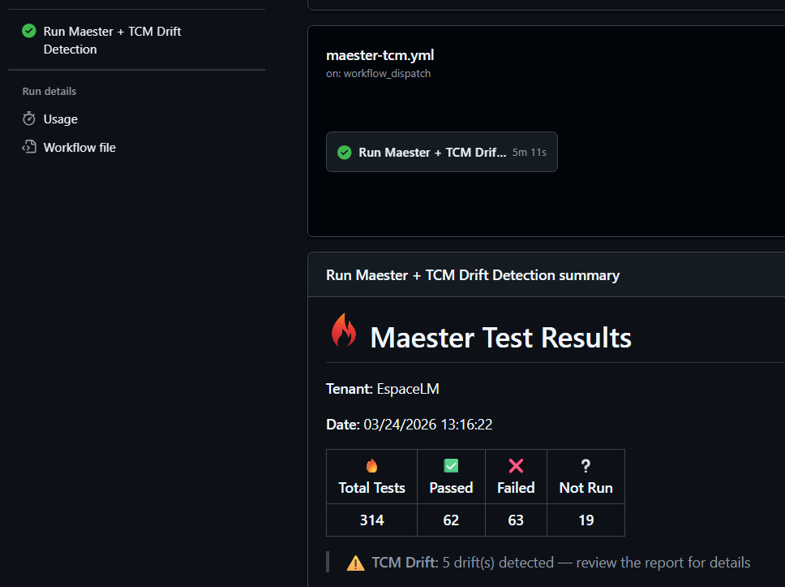
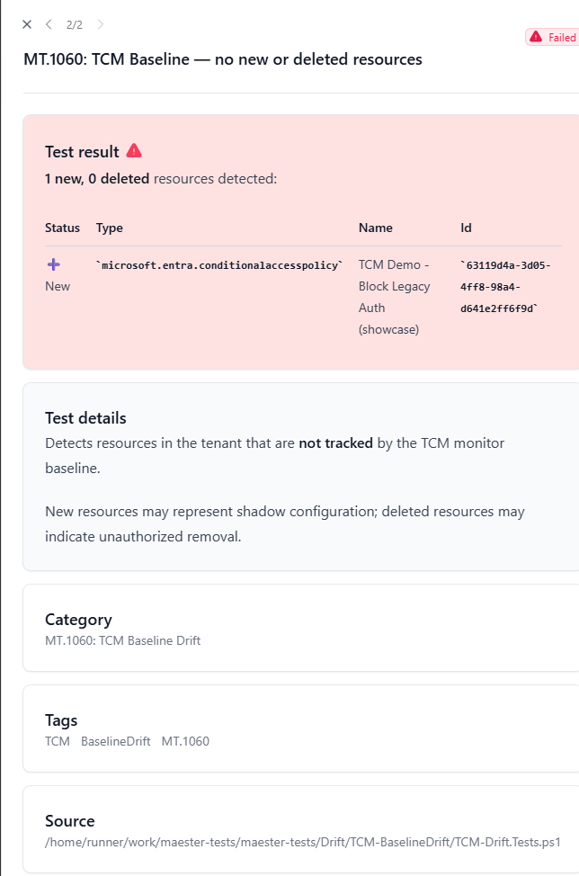

# 🚀 GitHub Actions: Maester + TCM Continuous Monitoring

**Automated daily M365 security checks and drift detection — unified HTML report, zero servers.**

> For other automation options (Windows Task Scheduler, Azure Automation), see the [Continuous Monitoring Guide](continuous-monitoring).

---

## Step 1: Create the Entra App

The [`New-MaesterServicePrincipal.ps1`](https://github.com/kayasax/EasyTCM/blob/main/scripts/New-MaesterServicePrincipal.ps1) script automates the entire Entra setup — from 17 manual portal steps to one command.

**Prerequisites:** [Microsoft.Graph.Authentication](https://learn.microsoft.com/powershell/microsoftgraph/installation) module + [GitHub CLI](https://cli.github.com/) (`gh auth login`) + Global Admin (or Application Admin + Security Admin).

```powershell
# Clone the repo
git clone https://github.com/kayasax/EasyTCM.git
cd EasyTCM

# Run the setup — auto-detects your GitHub repo from git remote
.\scripts\New-MaesterServicePrincipal.ps1 -IncludeExchange -IncludeTeams
```

> TCM permissions are included by default. Add `-IncludeTCM:$false` if you only want vanilla Maester.

The script will:
1. Create an Entra app registration ("Maester DevOps Account")
2. Grant all Maester Graph permissions + `ConfigurationMonitoring.ReadWrite.All` for TCM
3. Add a federated identity credential (OIDC — no secrets to rotate)
4. Set `AZURE_CLIENT_ID` and `AZURE_TENANT_ID` as GitHub secrets via `gh`

> **Prefer manual setup?** Follow the [official Maester guide](https://maester.dev/docs/monitoring/github#set-up-the-github-actions-workflow) for the app registration, then add `ConfigurationMonitoring.ReadWrite.All` for TCM and set `AZURE_CLIENT_ID` + `AZURE_TENANT_ID` as GitHub secrets.

---

## Step 2: Initialize TCM (One-Time)

The TCM service principal needs to be provisioned once before the workflow can read drift data. Run this from any machine with Global Admin:

```powershell
Install-Module EasyTCM -Scope CurrentUser
Connect-MgGraph -Scopes 'Application.ReadWrite.All','ConfigurationMonitoring.ReadWrite.All'
Start-TCMMonitoring
```

`Start-TCMMonitoring` is a guided wizard — it creates the TCM service principal, takes a snapshot of your tenant, and sets up a monitor that checks every 6 hours. Takes about 5 minutes.

---

## Step 3: Add the Workflow File

Copy [`maester-tcm.yml`](https://github.com/kayasax/EasyTCM/blob/main/templates/workflows/maester-tcm.yml) to your repository:

```powershell
# From inside your maester-tests repo
mkdir -p .github/workflows
Copy-Item <path-to-EasyTCM>/templates/workflows/maester-tcm.yml .github/workflows/
git add .github/workflows/maester-tcm.yml
git commit -m "Add Maester + TCM workflow"
git push
```

**That's it.** The workflow runs daily at 06:00 UTC and on manual trigger.

---

## What You Get

Every run does this automatically:

1. Authenticates via OIDC (zero secrets to rotate)
2. Installs Maester + EasyTCM
3. Runs 400+ Maester security tests (CIS, CISA SCuBA, EIDSCA)
4. Syncs TCM drift data into Maester test format
5. Runs all tests together → unified HTML report
6. Uploads report as artifact + rich job summary



The HTML report shows property-level drift detail — exactly which property, the expected value, and the current value:


### Drift = workflow failure = free alerting

When drift is detected, the Pester tests fail → GitHub marks the run as failed → **GitHub notifications** alert all repository watchers. No extra alerting setup needed.

---

## Customization

### Change the schedule

```yaml
# Every 6 hours (matches TCM's monitoring cycle)
- cron: '0 */6 * * *'

# Weekdays only at 07:30 UTC
- cron: '30 7 * * 1-5'
```

### Change the monitoring profile

```powershell
# Security-critical resources only (lower quota impact)
Start-TCMMonitoring -Profile SecurityCritical

# Broader coverage (default)
Start-TCMMonitoring -Profile Recommended
```

### Baseline comparison (detect new/deleted resources)

TCM drift only catches **property changes** on resources in the baseline. To also catch new CA policies or deleted transport rules, the workflow runs `-CompareBaseline` automatically on Mondays.

You can also trigger it manually:

```bash
gh workflow run maester-tcm.yml -f compare_baseline=true
```

> ⚠️ `-CompareBaseline` takes a fresh snapshot (counts against your daily quota). Use it no more than once per day.



### Teams notifications

Add a step that posts to a webhook on failure:

```yaml
- name: Notify Teams on drift
  if: failure()
  shell: pwsh
  env:
    TEAMS_WEBHOOK_URI: ${{ secrets.TEAMS_WEBHOOK_URI }}
  run: |
    $body = @{
      text = "⚠️ EasyTCM detected M365 tenant drift. See the workflow run for details."
    } | ConvertTo-Json
    Invoke-RestMethod -Uri $env:TEAMS_WEBHOOK_URI -Method Post `
        -Body $body -ContentType 'application/json'
```

---

## Troubleshooting

| Problem | Fix |
|---------|-----|
| `Test-TCMConnection` fails with "insufficient privileges" | App is missing `ConfigurationMonitoring.ReadWrite.All`. Grant it and re-consent. |
| "No monitors found" or empty drift | Run `Initialize-TCM` or `Start-TCMMonitoring` interactively once. |
| OIDC authentication fails | Federated credential must match exact org/repo/branch. Check `id-token: write` in workflow permissions. |
| Maester reports 0 tests | `Install-MaesterTests` failed. Check Gallery connectivity. Set `HTTP_PROXY` on corp runners. |
| Quota exceeded | Run `Get-TCMQuota`. Switch to `SecurityCritical` profile or reduce schedule frequency. |

---

## [← Maester Integration](maester-integration)
## [← Back to Home](.)
